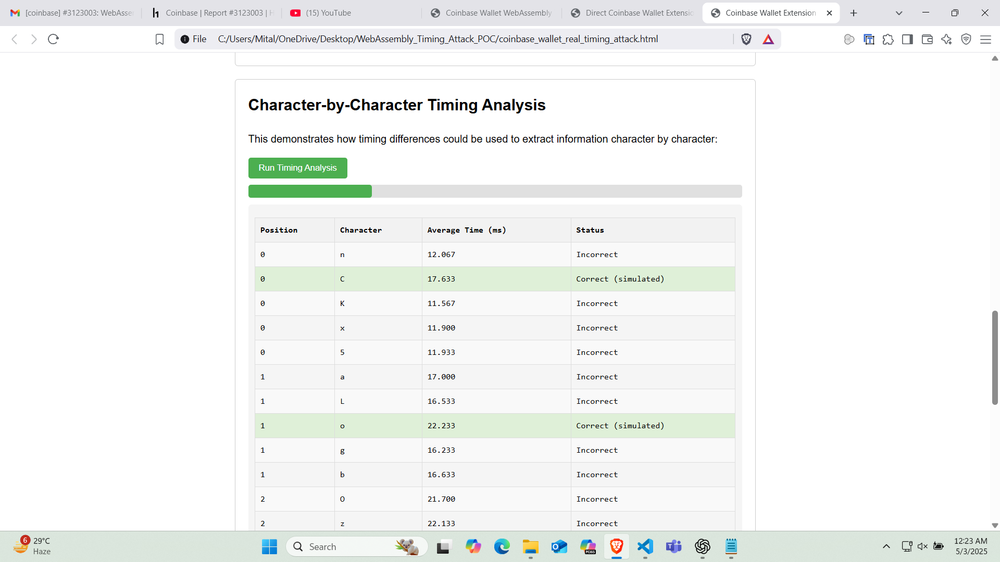

# Crop Damage Claim Management System

A comprehensive system for managing crop damage claims, featuring a Flutter mobile app for farmers to submit claims and a React web dashboard for officers to review and manage them. Both applications are powered by a shared Firebase backend.

## 🚀 Project Overview

This system streamlines the process of reporting and managing crop damage. Farmers can easily submit claims with photos and GPS data via the mobile app, while agricultural officers can efficiently review, approve, or reject these claims through a dedicated web portal.

## 🚀 Project Overview

This system streamlines the process of reporting and managing crop damage. Farmers can easily submit claims with photos and GPS data via the mobile app, while agricultural officers can efficiently review, approve, or reject these claims through a dedicated web portal.

## ️ Technologies Used

### Flutter Mobile Application
*   **Framework:** Flutter (Dart)
*   **State Management:** `flutter_bloc`
*   **Authentication:** Firebase Authentication (Phone Number OTP)
*   **Database:** Firebase Firestore
*   **Storage:** Firebase Storage
*   **Localization:** `easy_localization`
*   **Location:** `geolocator`
*   **Image/File Picking:** `image_picker`, `file_picker`

### React Web Dashboard
*   **Framework:** React.js
*   **Build Tool:** Create React App (standard React setup)
*   **Styling:** Inline CSS (for simplicity, can be extended with TailwindCSS/ShadCN UI as initially planned)
*   **Authentication:** Firebase Authentication (Email/Password for officers)
*   **Database:** Firebase Firestore
*   **Storage:** Firebase Storage
*   **Routing:** `react-router-dom`
*   **Date Formatting:** `date-fns`

## ✨ Features

### Flutter Mobile Application (Farmer App)
1.  **User Authentication:** Phone number OTP login.
2.  **Profile Setup:** Farmers can set up their profile.
3.  **Claim Submission:**
    *   Submit new crop damage claims.
    *   Attach crop photos.
    *   Include GPS coordinates of the damaged land.
    *   Specify damage reason/type.
    *   Upload supporting documents.
4.  **Claim Status Tracking:** View the status of submitted claims (Pending, Approved, Rejected).
5.  **Localization:** Support for multiple languages (English, Hindi, Marathi).

### React Web Dashboard (Officer Portal)
1.  **Officer Login Page:**
    *   Firebase Email/Password Authentication.
    *   (Originally planned: Only users with `role = 'officer'` in the `users` collection can log in. **Currently, authentication is removed for direct dashboard access for easier debugging.**)
2.  **Claim Review Dashboard:**
    *   Table view of all submitted claims from Firestore `claims` collection.
    *   Columns: Farmer Name, Submission Date, Damage Type, Status, Action.
    *   Filtering by `status` and `damageType`.
3.  **Detailed Claim Viewer:**
    *   Click to view comprehensive claim information in a modal.
    *   Displays uploaded crop photo, GPS coordinates (with embedded Google Map placeholder), supporting documents, damage type, and farmer’s profile.
4.  **Approve / Reject Workflow:**
    *   **Approve:** Update claim status to `approved`.
    *   **Reject:** Prompt for a reason, update status to `rejected`, and save remarks.
    *   Status updates are live in Firestore and visible to the farmer app.

## 📁 Firebase Firestore Schema

*   **`claims` Collection:**
    *   `id` (Document ID)
    *   `user_id` (string): ID of the farmer who submitted the claim.
    *   `image_url` (string): URL of the uploaded crop damage photo in Firebase Storage.
    *   `document_urls` (array of strings): URLs of any supporting documents.
    *   `gps` (GeoPoint): GPS coordinates (`latitude`, `longitude`) of the damaged land.
    *   `reason` (string): Description or type of damage (e.g., "Flood", "Pest Infestation").
    *   `status` (string): Current status of the claim (`pending`, `approved`, `rejected`).
    *   `officer_remarks` (string): Remarks added by the officer upon rejection.
    *   `submitted_at` (Timestamp): Date and time of claim submission.
    *   `land_address` (string): Address of the damaged land.
    *   `survey_khasra_number` (string): Survey/Khasra number of the land.
    *   `area_in_acres` (number): Area of the damaged land in acres.

*   **`users` Collection:**
    *   `id` (Document ID - matches Firebase Auth UID)
    *   `name` (string): Farmer's or Officer's name.
    *   `role` (string): User's role (`farmer`, `officer`).
    *   `address` (string): User's address.
    *   `phone` (string): User's phone number.

## ⚙️ Setup Instructions

### 1. Firebase Project Setup

1.  **Create a Firebase Project:** Go to [Firebase Console](https://console.firebase.google.com/) and create a new project.
2.  **Enable Services:**
    *   **Authentication:** Go to "Authentication" > "Sign-in method" and enable **Email/Password** and **Phone** sign-in providers.
    *   **Firestore Database:** Go to "Firestore Database" > "Create database". Start in production mode.
    *   **Cloud Storage:** Go to "Storage" > "Get started".
3.  **Firebase Configuration Files:**
    *   **For Flutter (Android):** Download `google-services.json` from "Project settings" > "Your apps" > "Android app". Place it in `flutter-app/android/app/`.
    *   **For Flutter (iOS/macOS):** Download `GoogleService-Info.plist` from "Project settings" > "Your apps" > "iOS app". Place it in `flutter-app/ios/Runner/`.
    *   **For Flutter (Web):** The `flutter-app/lib/firebase_options.dart` file is generated by FlutterFire CLI and contains web configuration.
    *   **For React Web App:** Get your web app's configuration from "Project settings" > "Your apps" > "Web app" (the `</>` icon). You will need the `apiKey`, `authDomain`, `projectId`, `storageBucket`, `messagingSenderId`, and `appId`.

4.  **Firestore Security Rules:**
    Go to "Firestore Database" > "Rules" and update them to allow read/write access for testing:
    ```firestore
    rules_version = '2';
    service cloud.firestore {
      match /databases/{database}/documents {
        match /claims/{claimId} {
          allow read, write: if true; // Allow public read/write for testing
        }
        match /users/{userId} {
          allow read: if true; // Allow public read for fetching farmer names
          allow write: if false; // Keep write restricted
        }
        match /{document=**} {
          allow read, write: if false; // Default deny for other collections
        }
      }
    }
    ```
    **Remember to click "Publish" after updating rules.**

5.  **Firebase Storage Security Rules:**
    Go to "Storage" > "Rules" and update them to allow read access for testing:
    ```storage
    rules_version = '2';
    service firebase.storage {
      match /b/{bucket}/o {
        match /{allPaths=**} {
          allow read: if true; // Allow public read access for testing
          allow write: if request.auth != null; // Keep write restricted to authenticated users
        }
      }
    }
    ```
    **Remember to click "Publish" after updating rules.**

6.  **Create Test Data (Manual):**
    *   **Officer User:** In Firebase Authentication, create a test user (e.g., `officer@example.com` with a password).
    *   **User Role:** In Firestore, create a `users` collection. Add a document with the UID of the officer user. Add a field `role` (string) with value `officer`.
    *   **Sample Claims:** In Firestore, create a `claims` collection and add some dummy claim documents with fields matching the schema above, including `status: 'pending'` for testing approve/reject.

### 2. Flutter App Setup

1.  **Navigate to the `flutter-app` directory:**
    ```bash
    cd flutter-app
    ```
2.  **Get Dependencies:**
    ```bash
    flutter pub get
    ```
3.  **Run FlutterFire Configure (if `firebase_options.dart` is missing or outdated):**
    ```bash
    flutterfire configure
    ```
    Follow the prompts to select your Firebase project and platforms.
4.  **Run the App:**
    ```bash
    flutter run
    ```
    (Specify a device if needed, e.g., `flutter run -d chrome` for web, or `flutter run -d <device_id>` for Android/iOS emulator/device).

### 3. React Web App Setup

1.  **Navigate to the `webapp` directory:**
    ```bash
    cd webapp
    ```
2.  **Create `.env` file:**
    Create a file named `.env` in the `webapp/` directory.
    Populate it with your Firebase web app configuration (from Firebase Project Settings > Your apps > Web app).

    ```dotenv
    REACT_APP_FIREBASE_API_KEY="YOUR_WEB_API_KEY"
    REACT_APP_FIREBASE_AUTH_DOMAIN="YOUR_AUTH_DOMAIN"
    REACT_APP_FIREBASE_PROJECT_ID="YOUR_PROJECT_ID"
    REACT_APP_FIREBASE_STORAGE_BUCKET="YOUR_STORAGE_BUCKET"
    REACT_APP_FIREBASE_MESSAGING_SENDER_ID="YOUR_MESSAGING_SENDER_ID"
    REACT_APP_FIREBASE_APP_ID="YOUR_APP_ID"
    ```
    **Note:** The `projectId` and `appId` might already be pre-filled based on previous interactions, but ensure they match your *web app* configuration exactly.

3.  **Install Dependencies:**
    ```bash
    npm install
    ```
4.  **Run the App:**
    ```bash
    npm start
    ```
    The application will typically open in your browser at `http://localhost:3000/`.

## 🤝 Connection Between Web App and Flutter App

Both the Flutter mobile application and the React web dashboard are designed to interact with the **same Firebase project and its Firestore database and Storage buckets**.

*   **Data Sharing:** Claims submitted by farmers via the Flutter app are stored in the `claims` Firestore collection. Officers viewing the web dashboard read directly from this same `claims` collection.
*   **Real-time Updates:** Changes made by officers (approving/rejecting claims) are updated in Firestore, and these changes can be reflected in real-time in the Flutter app (if implemented to listen for snapshot changes).
*   **User Management:** User profiles (including roles) are managed in Firestore's `users` collection, linked by Firebase Authentication UIDs.

This shared backend ensures a seamless flow of information between the farmer-facing mobile application and the officer-facing web dashboard.

## 📸 Screenshots

### Flutter Mobile Application




### React Web Dashboard


## License

This project is licensed under the [MIT License](LICENSE).
